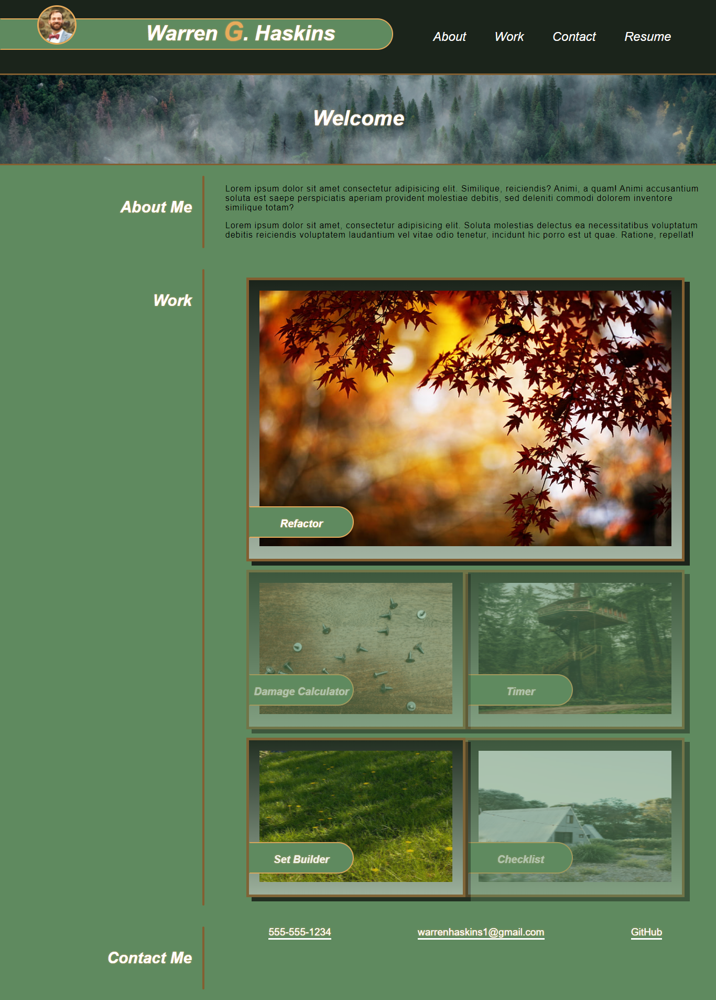

# WGH-Portfolio-Overview

## Description

- With the desire to get a better understanding of some fundamentals of html/css as well as some of the more advanced features, I have designed my first Web Portfolio.

- There was much to learn, and there still is....Some of the standouts are the usage of Flex-Box, Media Queries and psuedo-classes. The amount of tools at our disposal utilizing css are vast.

## Installation 

- The only thing neccessary to use this project are a device with a web-browser and internet connection.

## Usage

- The user may access the webpage to get an overview of my first Web Design Portfolio which is an ongoing work in progress.

## Credits

- https://www.w3schools.com/
- https://css-tricks.com/
- https://hackernoon.com/
- https://unsplash.com/